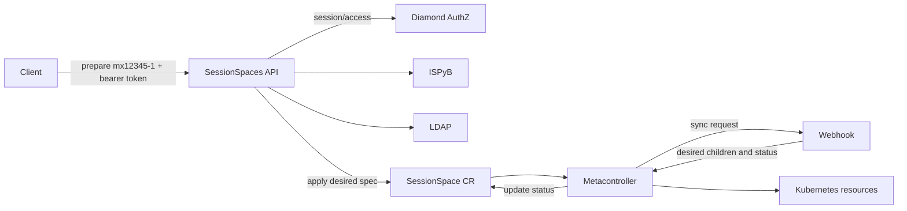

# SessionSpaces Controller

The SessionSpaces controller provisions Kubernetes environments for proposal
visits such as `mx12345-1`. It provides two Rust binaries that share the
cluster-scoped `SessionSpace` resource model.

## API

The `api` binary accepts a namespace through `POST /prepare`, for example
`{"namespace":"mx12345-1"}` with an `Authorization: Bearer <Keycloak JWT>`
header. It validates the name, checks `session/access` on Diamond AuthZ for
the caller, then resolves authoritative visit, storage and membership data
from ISPyB and LDAP, and creates or refreshes an Active SessionSpace.

The access check runs before any metadata lookup: missing credentials return
`401`, policy denial returns `403`, and an unreachable policy server fails
closed. Denials are deliberately opaque, the policy answers `false` both for
missing visits and unauthorized callers, so the API never reveals which case
applied.

Preparation succeeds only when the current generation is observed and reports
`Ready=True`. Existing and dormant SessionSpaces are refreshed and reactivated
through the same operation. The apply takes ownership of the whole `spec`,
so a previous manual edit cannot block reactivation with a 409 conflict.

## Webhook

The `webhook` binary handles Metacontroller sync requests. For an Active
SessionSpace, it renders the Namespace, `sessionspaces` ConfigMap,
`argo-workflow` ServiceAccount, workflow and member RoleBindings, and
`default-queue` LocalQueue from the CR spec.

It observes the managed children and publishes generation-aware lifecycle
status. For a Dormant SessionSpace, it returns no desired children and waits for
their removal while retaining the parent CR for later reactivation.

| Phase | Ready | Dormant |
| --- | --- | --- |
| Activating | False | False |
| Active | True | False |
| Deactivating | False | False |
| Dormant | False | True |
