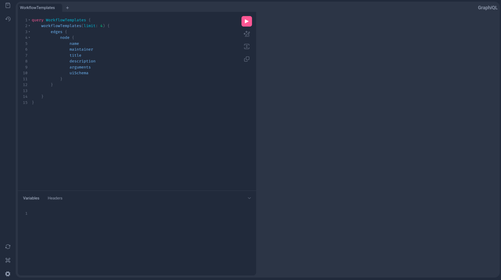

# How to Run A GraphQL Query

This guide explains how to run a GRAPHQL query for workflows using the Workflows
Dashboard or alternative tools.
The Workflows Dashboard does provide a GraphiQL client to write queries to
the GraphQL endpoint which is shown below.

## Available Endpoints
[Production](https://workflows.diamond.ac.uk/graphql)

[Staging](https://staging.workflows.diamond.ac.uk/graphql)

## The Dashboard

The Workflows Dashboard includes a built-in GraphiQL client for writing and testing queries against
the GRAPHQL endppoint.

### iGraphQL Client


## Exploring the Schema

Click the *Docs* button (top-left) to browse the schema.
The schema gives you an overview of available variables and their required types and helps build
your query as a query, mutation or subscription.
Alternatively, use Ctrl + Space inside the query editor to view available fields and options while
writing the query.

### Example Query

```
query WorkflowTemplates {
  workflowTemplates(limit: 4) {
    edges {
      node {
        name
        maintainer<F6>
        suite
        description
        arguments
        uiSchema
      }
    }
  }
}
```

## Adding Authentication

All queries require an *authentication token* in the request headers.

Add the following header:
```JSON
{
  "Authorization": "Bearer <your-access-token>"
}
```

### Obtaining a Token
Run the following command to get a token in with the correct client id.
Please take attention to which oidc-client-id you are using.
Enter your username and password if prompted.

```sh
module load argus
# Production
kubectl oidc-login get-token --oidc-issuer-url=https://authn.diamond.ac.uk/realms/master --oidc-client-id=workflows-cluster --grant-type=password --oidc-use-access-token | jq -r '.status.token'
# Staging
kubectl oidc-login get-token --oidc-issuer-url=https://authn.diamond.ac.uk/realms/master --oidc-client-id=workflows-cluster-staging --grant-type=password --oidc-use-access-token | jq -r '.status.token'
```

Paste the token into the *Authorization* header before executing your query.

## Further Reading

For more information on how to use the GraphQL Dashboard please have a look at the official
GraphiQL docs [here](https://github.com/graphql/graphiql)

## Alternative Clients

There are alternative clients that can be used such as [*Postman*.](https://www.postman.com/)
When configuring authorization for these tools:
- store any sensitive data (passwords, tokens) securley as variables
- avoid hardcoding credentials in requests

